# Diagrammer

Dette dokument indeholder alle diagrammer der er blevet lavet i projektet.

## Domænemodel

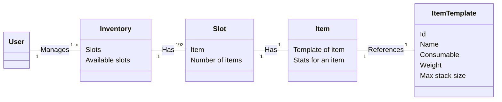

## Systemsekvensdiagram

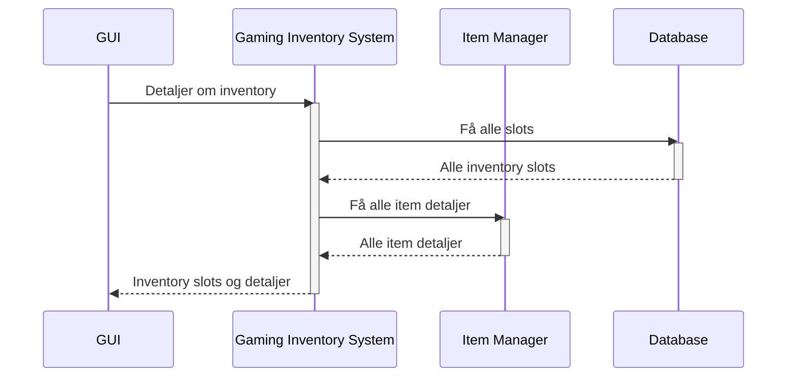

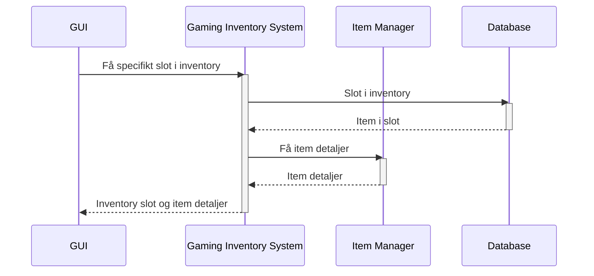

## Hele inv

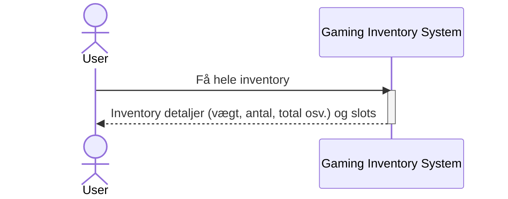

## Enkelt slot

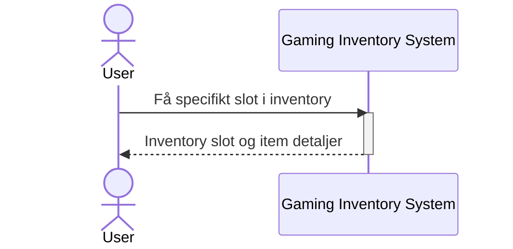

## Import

## Export

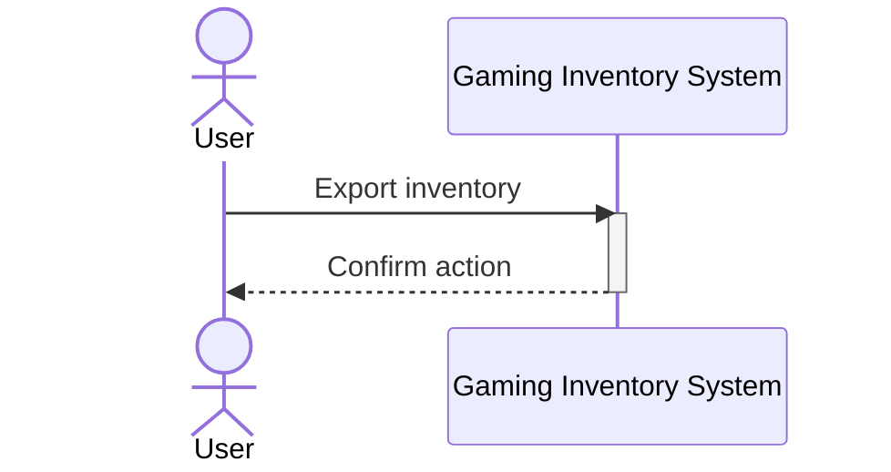

## Klassediagram

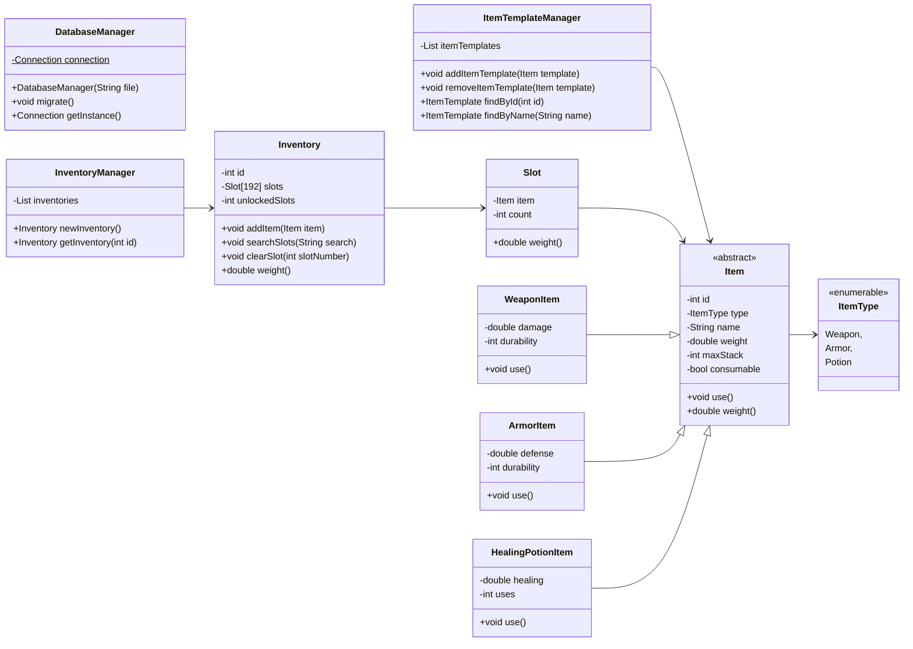

## Sekvensdiagram 1 Set slot manually

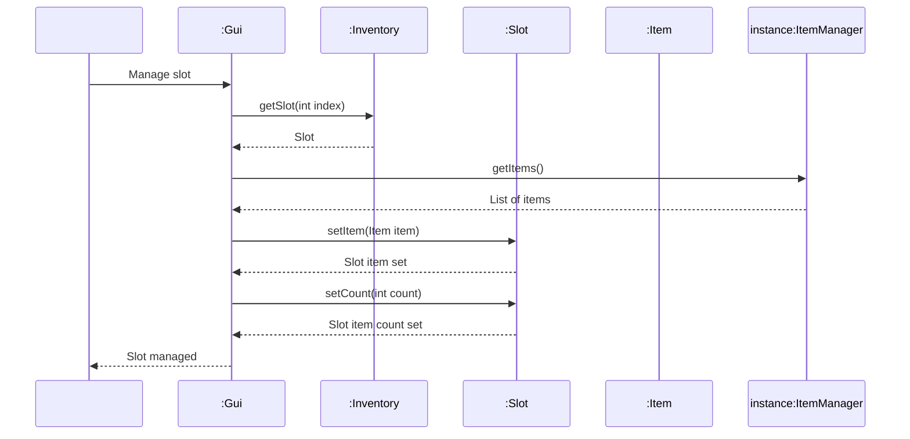

## Sekvensdiagram: List all items

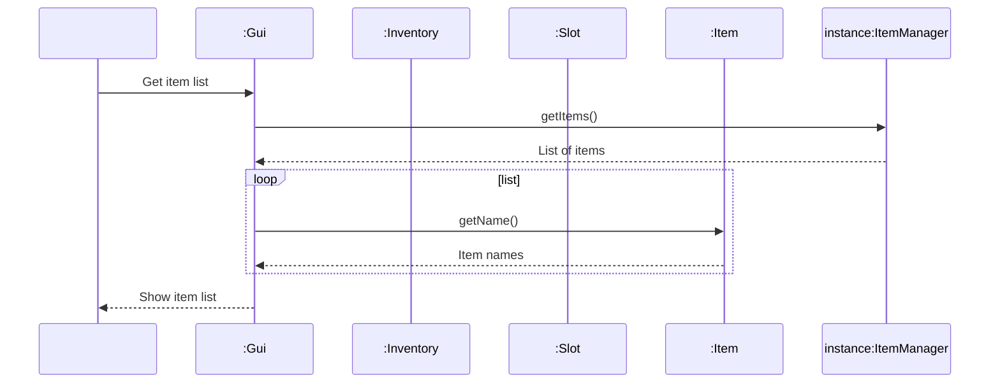

## Sekvensdiagram: Add item to inventory

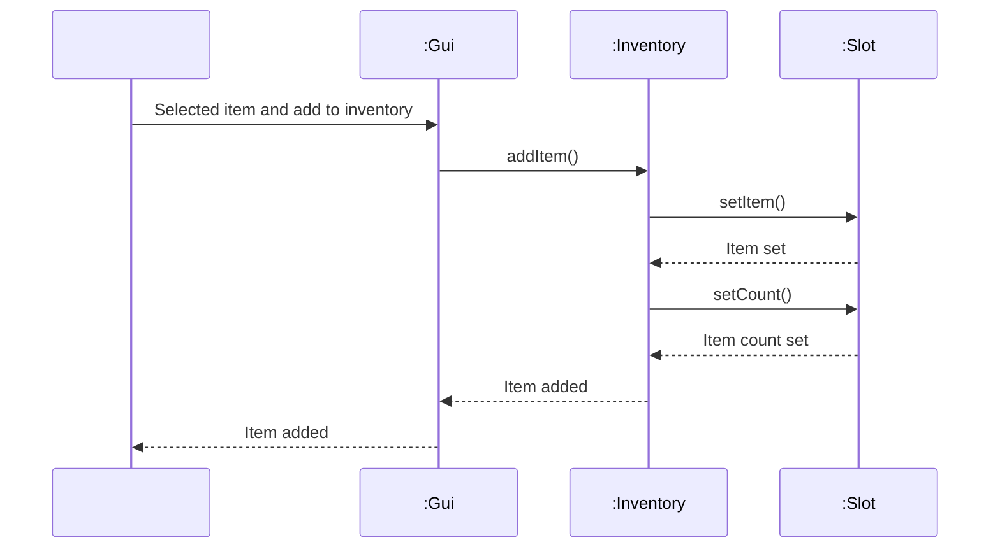

## Sekvensdiagram: Vælg specifikt slot

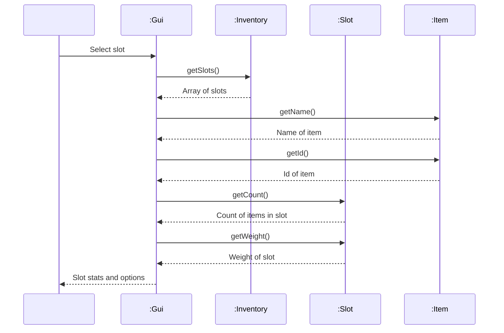

## Klassediagram

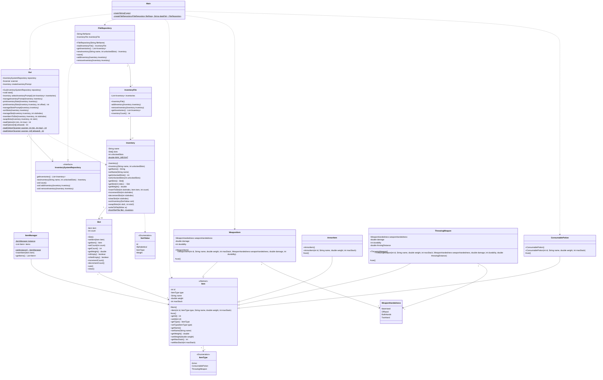
